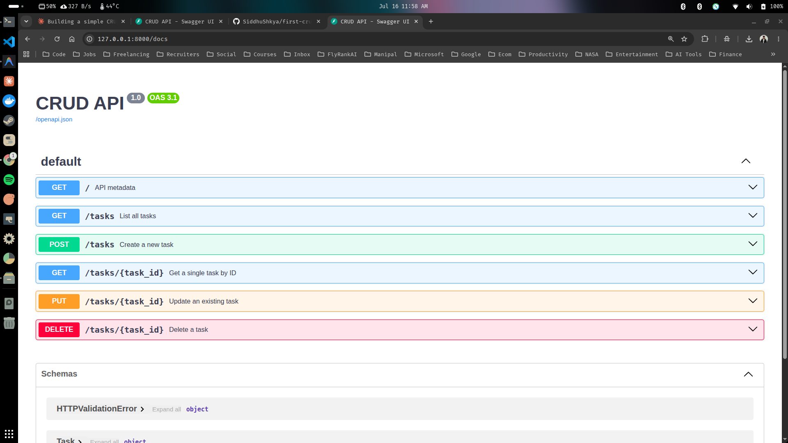

# First CRUD API

## Project Description
This is a small backend API that manages a to-do list, built as part of the "Build your first CRUD API" assignment. It implements the four standard CRUD operations (Create, Read, Update, Delete) using Python and FastAPI. All data is stored in-memory (no database), meaning the data resets whenever the server restarts. 

## Project Structure
```text
first-crud-api/
├── main.py                   # Core application file containing all routing and logic
├── requirements.txt          # Project dependencies (FastAPI, Uvicorn, Pydantic)
├── .gitignore                # Ignored files (venv, pycache)
├── swagger-screenshot.png    # Screenshot of the Swagger UI
└── README.md                 # Project documentation
```

## Setup and Run Instructions

To install dependencies and start the server locally, run the following commands in your terminal:

```bash
$ python3 -m venv venv
$ source venv/bin/activate
$ pip install -r requirements.txt
$ fastapi dev
```

*The server will start on `http://127.0.0.1:8000`.*

## Endpoints

| CRUD operation | HTTP method | Endpoint | Meaning |
|---|---|---|---|
| Read | GET | `/` | Retrieve API metadata |
| Read | GET | `/tasks` | List all tasks |
| Read | GET | `/tasks/{task_id}` | Get a single task by its ID |
| Create | POST | `/tasks` | Add a new task (body: `{"task": "...", "status": false}`) |
| Update | PUT | `/tasks/{task_id}` | Update an existing task |
| Delete | DELETE | `/tasks/{task_id}` | Remove a task |

## Interactive Documentation (Swagger UI)

FastAPI automatically generates interactive API documentation. Once the server is running, visit:
**`http://127.0.0.1:8000/docs`**

 
