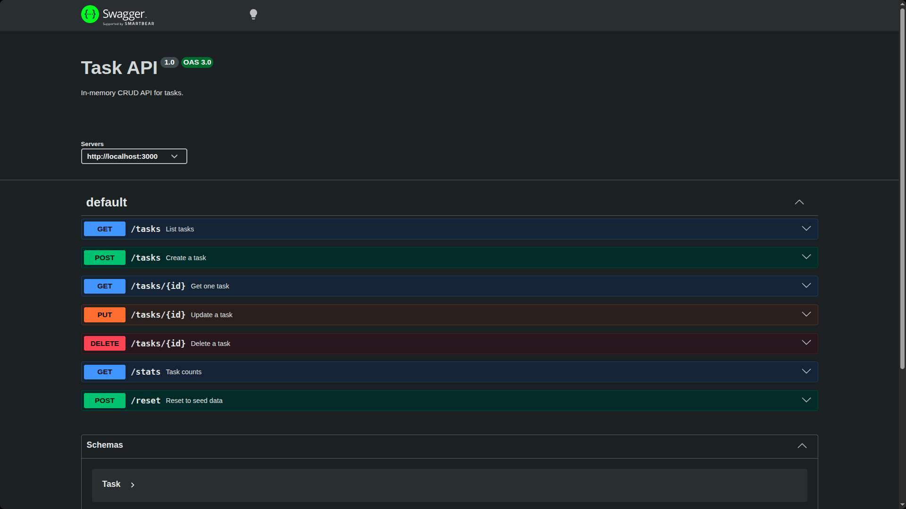

# Build Your First CRUD API (Node.js & Express)

## Project Description
This is a small backend API that manages a to-do list, built as part of the "Build your first CRUD API" assignment. The application is built using **JavaScript (Node.js & Express)**.

To ensure clean code separation, scalability, and maintainability, the project implements a **Layered (3-Tier) Architecture** (Routes -> Services -> Repositories) along with centralized error handling.

All task data is stored in-memory (no database), meaning the data resets whenever the server restarts.

---

## Architectural Design

The codebase is organized into distinct layers to separate concerns:

1. **Presentation / Route Layer (`src/routes/`)**
   - Serves as the entry point for HTTP requests.
   - Responsible for extracting input from requests (parameters, query strings, headers, body) and returning JSON responses with the appropriate HTTP status codes.
   - Keeps HTTP-specific logic decoupled from business rules. If an error occurs, it is forwarded using `next(err)`.
   
2. **Service / Business Logic Layer (`src/services/`)**
   - Contains all the validation and business logic rules (e.g., ensuring title is not empty, validating parameter types, stats aggregation).
   - Throws custom domain-specific errors (`ValidationError` or `NotFoundError`) when a rule is violated. It knows nothing about HTTP or status codes.

3. **Repository / Data Access Layer (`src/repositories/`)**
   - Manages data storage and retrieval. 
   - Abstracts how and where tasks are persisted (in this case, in-memory array manipulation).

4. **Domain Errors (`src/errors.js`)**
   - Custom, lightweight error classes used by the services.

5. **Error-Handling Middleware (`src/middleware/error-handler.js`)**
   - A single, centralized middleware that catches domain errors thrown from the service layer and translates them into appropriate HTTP status codes (`400 Bad Request` or `404 Not Found`). Unhandled errors result in a generic `500 Internal Server Error`.

---

## Project Structure
```text
first-crud-api/
├── index.js                  # Entry point that starts the server
├── openapi.json              # OpenAPI specification for the API endpoints
├── package.json              # NPM package configurations and dependency listings
├── package-lock.json         # Lockfile for NPM dependencies
├── .gitignore                # Ignored files (node_modules, etc.)
├── swagger-ui.png            # Screenshot of the Swagger UI
├── README.md                 # Project documentation
└── src/
    ├── app.js                # App factory putting together Express routes and middlewares
    ├── errors.js             # Custom domain error classes
    ├── middleware/
    │   └── error-handler.js  # Global error handling middleware
    ├── repositories/
    │   └── tasks.repository.js # In-memory storage/data access layer
    ├── routes/
    │   ├── meta.routes.js    # Routes for metadata (GET /, GET /health)
    │   └── tasks.routes.js   # Routes for task-related endpoints
    └── services/
        └── tasks.service.js  # Service layer containing business and validation logic
```

## Setup and Run Instructions

To install dependencies and start the server locally, run the following commands in your terminal:

```bash
# Install dependencies
npm install

# Start the server (configured to run node index.js)
npm start
```

*The server will start on `http://localhost:3000`.*

---

## Endpoints

### `GET /`

Returns metadata about the API and available root paths.

**Response**

```json
{
  "name": "Task API",
  "version": "1.0",
  "endpoints": [
    "/tasks",
    "/stats",
    "/reset"
  ]
}
```

**Example**

```bash
curl http://localhost:3000/
```

### `GET /health`

Health check endpoint to verify the server status.

**Response**

```json
{
  "status": "ok"
}
```

**Example**

```bash
curl http://localhost:3000/health
```

### `GET /tasks`

Returns all tasks. Optional query parameters filter the list.

| Query | Example | Effect |
|-------|---------|--------|
| `done` | `?done=true` | Only finished tasks |
| `done` | `?done=false` | Only open tasks |
| `search` | `?search=dog` | Title contains the word (case-insensitive) |

Filters can be combined: `?done=false&search=water`

**Response**

```json
[
  { "id": 1, "title": "Walk the dog", "done": true },
  { "id": 2, "title": "Watch a movie", "done": false },
  { "id": 3, "title": "Drink 1l water", "done": false }
]
```

**Example**

```bash
curl http://localhost:3000/tasks
curl "http://localhost:3000/tasks?done=true"
curl "http://localhost:3000/tasks?search=dog"
```

### `GET /stats`

Returns computed counts for the current task list.

**Response**

```json
{ "total": 3, "done": 1, "open": 2 }
```

**Example**

```bash
curl http://localhost:3000/stats
```

### `POST /reset`

Restores the three seed example tasks. Useful for demos and testing.

**Response (200)**

```json
[
  { "id": 1, "title": "Walk the dog", "done": true },
  { "id": 2, "title": "Watch a movie", "done": false },
  { "id": 3, "title": "Drink 1l water", "done": false }
]
```

**Example**

```bash
curl -X POST http://localhost:3000/reset
```

### `GET /tasks/:id`

Returns a single task by id.

**Response (200)**

```json
{ "id": 1, "title": "Walk the dog", "done": true }
```

**Response (404)**

```json
{ "error": "Task 99 not found" }
```

**Example**

```bash
curl http://localhost:3000/tasks/1
curl http://localhost:3000/tasks/99
```

### `POST /tasks`

Creates a new task.

**Request body**

```json
{ "title": "Buy milk" }
```

**Response (201)**

```json
{ "id": 4, "title": "Buy milk", "done": false }
```

**Response (400)**

```json
{ "error": "title is required and cannot be empty" }
```

**Example**

```bash
curl -X POST http://localhost:3000/tasks \
  -H "Content-Type: application/json" \
  -d '{"title": "Buy milk"}'
```

### `PUT /tasks/:id`

Updates a task's `title` and/or `done`. Send one or both fields; omitted fields stay unchanged.

**Request body**

```json
{ "title": "Walk the dog (longer)", "done": true }
```

**Response (200)**

```json
{ "id": 1, "title": "Walk the dog (longer)", "done": true }
```

**Response (400)**

```json
{ "error": "request body must include title and/or done" }
```

**Response (404)**

```json
{ "error": "Task 99 not found" }
```

**Example**

```bash
curl -X PUT http://localhost:3000/tasks/1 \
  -H "Content-Type: application/json" \
  -d '{"done": true}'
```

### `DELETE /tasks/:id`

Deletes a task by id.

**Response (204)**

Empty body — success, nothing to return.

**Response (404)**

```json
{ "error": "Task 99 not found" }
```

**Example**

```bash
curl -X DELETE http://localhost:3000/tasks/1
```

---

## Interactive Documentation (Swagger UI)

Express serves the interactive Swagger API documentation automatically using `swagger-ui-express` and `openapi.json`. Once the server is running, visit:

👉 **`http://localhost:3000/docs`**


